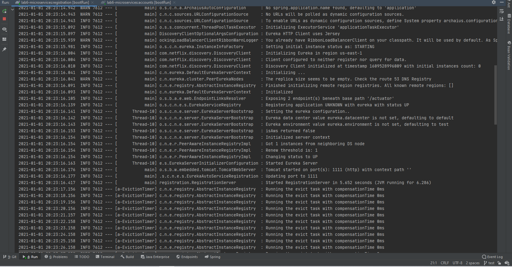
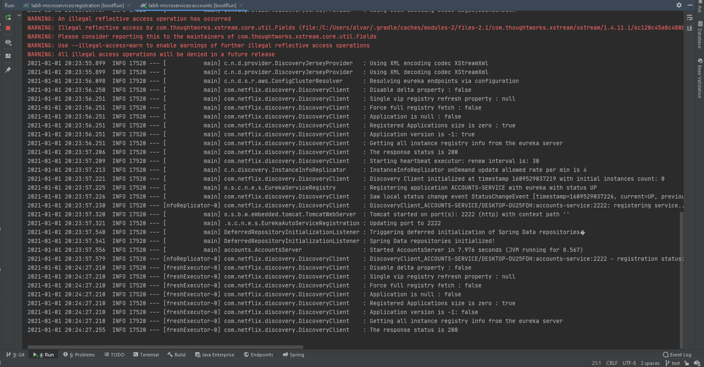
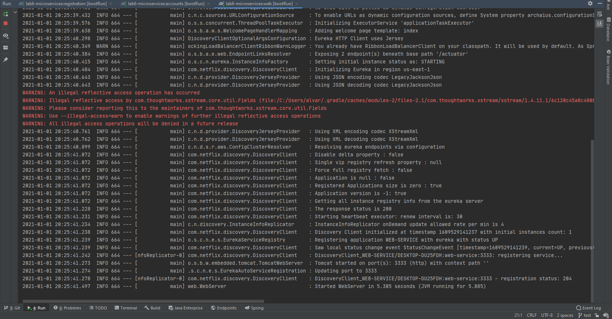
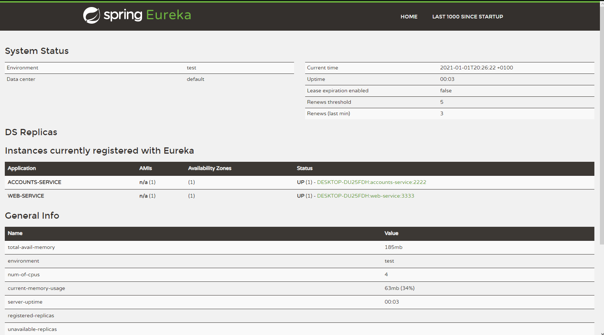
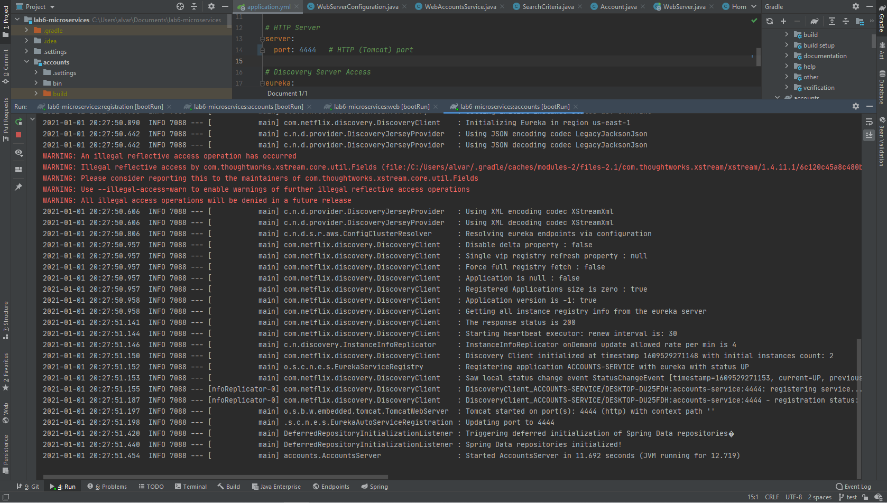
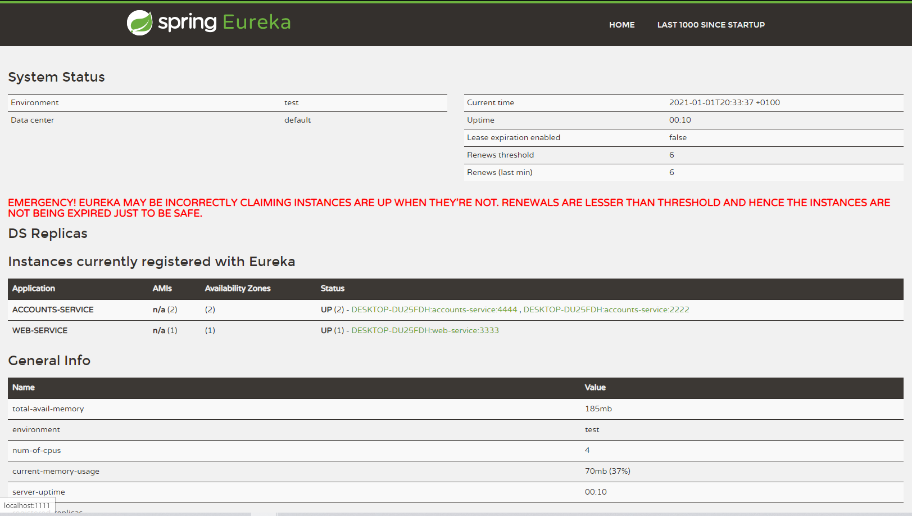
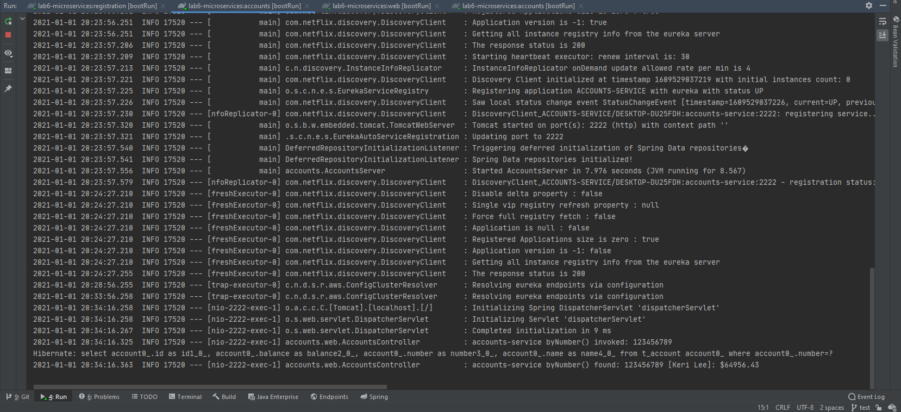
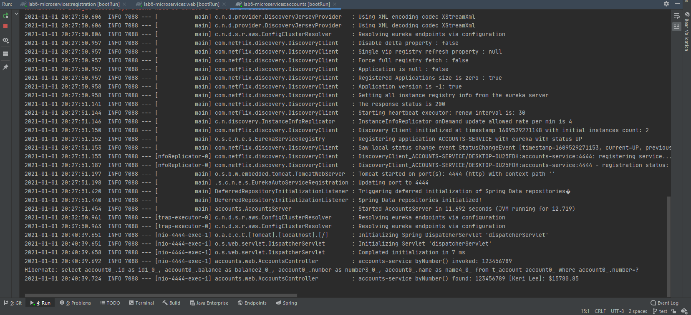

# Lab6 - Microservices
## Running all the services individually
At first, all the three services have been launched in separated terminals. The following command has been executed:
``` 
gradle :<service>:bootRun 
```

Registration service running on port 1111

Accounts service running on port 2222.

Web service running on port 3333.

Once each service is running, we check Eureka Dashboard to see if both accounts and web instances have been registered in Eureka

So both instances appear and their status are ``UP``


## Running a second accounts service instance
Afterwards, we have to modify the ``application.yml`` from accounts service package to run the new instance on port 4444.
```
# HTTP Server
server:
  port: 4444
```
2nd Accounts service instance running on port 4444


Eureka registers the new instance and updates the info shown in the dashboard



## -   What happens when you kill the microservice  `accounts (2222)`  and do requests to  `web`?  Can the web service provide information about the accounts again? Why?
Before killing the microservice running on port 2222, a first check has been done by doing a request to ``https://localhost:3333/accounts/123456789``

As we see, only one of the two accounts services replied. This is due to the client load balancer configured on ``WebServerConfiguration.java``.
With this configuration, if we do a request to the ``ACCOUNTS-SERVICE``, at first it needs to ask Eureka what's the address of this service. In this particular case, 
the accounts service running on port 2222 replies.

After doing that first test, let's stop the microservice running on port 2222 and do again a request to ``https://localhost:3333/accounts/123456789`` 
to check if the web service can provide accounts functionality.


As we see, there is only one account service running on port 4444. However, the request has been successfully replied by this service despite killing the another service.
This is happening due to the load balancer which I have mentioned previously. In this case the request to ``ACCOUNTS-SERVICE`` has been received by the unique accounts service running at this moment (on port 4444).


